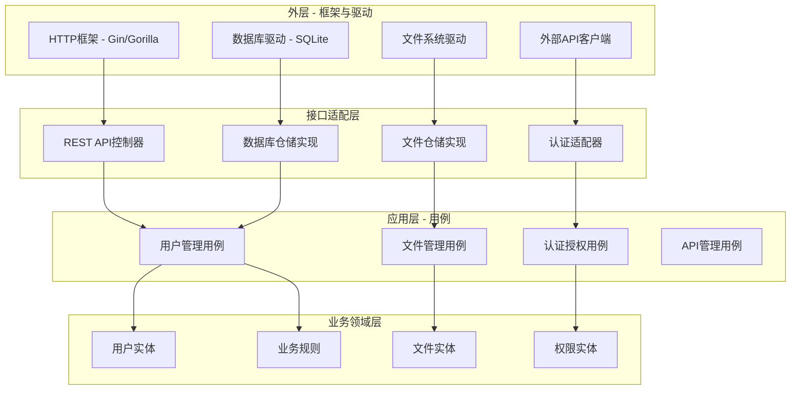

# Secure File Hub 系统架构分析与重构建议

## 📋 当前架构问题分析

### 🔍 1. 架构混乱点识别

#### 1.1 代码组织结构混乱

**问题描述：**
- 项目根目录存在多个不相关的配置文件（configs/, certs/, downloads/等）
- 前后端代码混合部署，耦合度过高
- 测试代码分散，缺乏统一管理

**具体问题：**
```
当前结构问题：
├── cmd/server/         # 主程序入口 ✅
├── internal/           # 内部包 ✅
├── frontend/           # 前端应用 ⚠️ 混合架构
├── configs/            # ❌ 配置文件位置混乱
├── certs/              # ❌ 证书文件暴露在根目录
├── downloads/          # ❌ 业务数据与代码混合
├── data/               # ❌ 数据库文件位置不当
├── logs.db             # ❌ 日志文件散落根目录
└── tests/              # ⚠️ 测试目录位置不当
```

#### 1.2 模块边界不清晰

**问题识别：**
- `internal/` 模块职责重叠，缺乏清晰的边界定义
- `handler` 模块承担过多责任（HTTP处理、业务逻辑、文件操作）
- `auth` 模块与 `database` 模块耦合过紧
- 缺乏明确的服务层抽象

#### 1.3 配置管理混乱

**问题分析：**
- 配置文件分散在多个目录（configs/, downloads/configs/）
- 环境变量与配置文件混合使用，缺乏统一管理
- 敏感信息（证书、密钥）与普通配置混合存储

#### 1.4 数据存储架构不一致

**问题识别：**
- 数据库文件 (fileserver.db) 位置不当
- 文件存储目录 (downloads/) 与应用代码混合
- 日志存储分散（logs.db 在根目录，其他日志在 logs/）

### 🏗️ 2. 推荐的系统架构重构方案

#### 2.1 清洁架构（Clean Architecture）实现



#### 2.2 推荐的目录结构重构

```
secure-file-hub/
├── cmd/                    # 应用程序入口点
│   ├── api/               # API服务器主程序
│   │   └── main.go
│   ├── migration/         # 数据迁移工具
│   │   └── main.go
│   └── worker/            # 后台任务程序
│       └── main.go
├── internal/              # 私有应用和库代码
│   ├── domain/            # 业务领域层
│   │   ├── entities/      # 业务实体
│   │   ├── repositories/  # 仓储接口
│   │   └── services/      # 领域服务
│   ├── application/       # 应用用例层
│   │   ├── usecases/      # 用例实现
│   │   ├── dto/           # 数据传输对象
│   │   └── interfaces/    # 应用接口
│   ├── infrastructure/    # 基础设施层
│   │   ├── database/      # 数据库实现
│   │   ├── filesystem/    # 文件系统实现
│   │   ├── http/          # HTTP客户端
│   │   └── config/        # 配置管理
│   └── presentation/      # 表现层
│       ├── http/          # HTTP处理器
│       ├── middleware/    # 中间件
│       └── routes/        # 路由定义
├── web/                   # 前端应用（独立部署）
│   ├── src/               # React/Next.js源码
│   ├── public/            # 静态资源
│   ├── package.json
│   └── Dockerfile
├── deployments/           # 部署配置
│   ├── docker/            # Docker相关文件
│   ├── k8s/               # Kubernetes配置
│   └── terraform/         # 基础设施代码
├── configs/               # 配置文件模板
│   ├── app.yaml.example
│   ├── database.yaml.example
│   └── security.yaml.example
├── scripts/               # 构建和部署脚本
├── docs/                  # 项目文档
├── tests/                 # 测试代码
│   ├── unit/              # 单元测试
│   ├── integration/       # 集成测试
│   └── e2e/               # 端到端测试
├── migrations/            # 数据库迁移文件
├── go.mod
└── README.md
```

### 🔧 3. 具体重构建议

#### 3.1 模块解耦重构

**当前问题：** `handler` 模块职责过多

**重构方案：**
```go
// 重构前 - internal/handler/handler.go （职责混乱）
type Handler struct {
    // HTTP处理、业务逻辑、数据访问全部混合
}

// 重构后 - 分离职责
// internal/presentation/http/controllers/file_controller.go
type FileController struct {
    fileUseCase application.FileUseCase
}

// internal/application/usecases/file_usecase.go
type FileUseCase struct {
    fileRepo domain.FileRepository
    authService domain.AuthService
}

// internal/domain/entities/file.go
type File struct {
    ID       string
    Name     string
    Path     string
    Owner    string
    // ... 业务属性
}

// internal/infrastructure/database/file_repository.go
type FileRepository struct {
    db *sql.DB
}
```

#### 3.2 配置管理重构

**重构方案：**
```go
// internal/infrastructure/config/config.go
type Config struct {
    Server   ServerConfig   `yaml:"server"`
    Database DatabaseConfig `yaml:"database"`
    Security SecurityConfig `yaml:"security"`
    Storage  StorageConfig  `yaml:"storage"`
}

type ServerConfig struct {
    Host string `yaml:"host" env:"SERVER_HOST" default:"localhost"`
    Port int    `yaml:"port" env:"SERVER_PORT" default:"8443"`
    TLS  TLSConfig `yaml:"tls"`
}

type DatabaseConfig struct {
    Driver   string `yaml:"driver" default:"sqlite"`
    Host     string `yaml:"host" env:"DB_HOST"`
    Port     int    `yaml:"port" env:"DB_PORT"`
    Database string `yaml:"database" env:"DB_NAME"`
}
```

**配置文件结构：**
```yaml
# configs/app.yaml
server:
  host: 0.0.0.0
  port: 8443
  tls:
    cert_file: /etc/ssl/certs/server.crt
    key_file: /etc/ssl/private/server.key

database:
  driver: sqlite
  database: /var/lib/fileserver/database.db

security:
  jwt:
    secret_key_env: JWT_SECRET_KEY
    expiration: 24h
  rate_limiting:
    enabled: true
    requests_per_minute: 100
```

#### 3.3 依赖注入重构

**实现依赖注入容器：**
```go
// internal/infrastructure/di/container.go
type Container struct {
    config       *config.Config
    db           *sql.DB

    // 仓储层
    userRepo     domain.UserRepository
    fileRepo     domain.FileRepository

    // 应用层
    userUseCase  application.UserUseCase
    fileUseCase  application.FileUseCase

    // 控制器层
    userController presentation.UserController
    fileController presentation.FileController
}

func NewContainer(config *config.Config) (*Container, error) {
    container := &Container{config: config}

    // 初始化基础设施
    if err := container.initInfrastructure(); err != nil {
        return nil, err
    }

    // 初始化仓储
    container.initRepositories()

    // 初始化用例
    container.initUseCases()

    // 初始化控制器
    container.initControllers()

    return container, nil
}
```

#### 3.4 错误处理重构

**统一错误处理机制：**
```go
// internal/domain/errors/errors.go
type DomainError struct {
    Code    string `json:"code"`
    Message string `json:"message"`
    Details map[string]interface{} `json:"details,omitempty"`
}

func (e DomainError) Error() string {
    return e.Message
}

var (
    ErrUserNotFound     = DomainError{Code: "USER_NOT_FOUND", Message: "用户不存在"}
    ErrInvalidPassword  = DomainError{Code: "INVALID_PASSWORD", Message: "密码错误"}
    ErrFileNotFound     = DomainError{Code: "FILE_NOT_FOUND", Message: "文件不存在"}
    ErrInsufficientAuth = DomainError{Code: "INSUFFICIENT_AUTH", Message: "权限不足"}
)

// internal/presentation/http/middleware/error_handler.go
func ErrorHandler() gin.HandlerFunc {
    return gin.CustomRecovery(func(c *gin.Context, recovered interface{}) {
        if err, ok := recovered.(domain.DomainError); ok {
            c.JSON(http.StatusBadRequest, gin.H{
                "success": false,
                "error":   err,
            })
            return
        }

        // 处理其他类型错误
        c.JSON(http.StatusInternalServerError, gin.H{
            "success": false,
            "error": map[string]string{
                "code":    "INTERNAL_ERROR",
                "message": "内部服务器错误",
            },
        })
    })
}
```

### 🚀 4. 分阶段重构计划

#### 阶段一：基础架构重构
1. **目录结构重组**
   - 创建新的目录结构
   - 分离前后端代码
   - 统一配置管理

2. **依赖注入实现**
   - 实现DI容器
   - 重构主要模块的依赖关系

#### 阶段二：领域模型重构
1. **提取业务实体**
   - 定义用户、文件、权限等实体
   - 实现业务规则验证

2. **仓储模式实现**
   - 定义仓储接口
   - 实现数据库仓储

#### 阶段三：应用层重构
1. **用例实现**
   - 提取业务用例
   - 实现用例接口

2. **服务层重构**
   - 重构现有Handler为Controller
   - 实现清晰的API层

#### 阶段四：测试和部署优化
1. **测试重构**
   - 重组测试结构
   - 增加单元测试覆盖率

2. **部署优化**
   - Docker镜像分离
   - 部署脚本优化

### ✅ 5. 重构后预期收益

#### 5.1 可维护性提升
- **模块职责清晰**：每个模块有明确的职责边界
- **依赖关系简化**：通过依赖注入降低模块间耦合
- **配置管理统一**：集中化的配置管理

#### 5.2 可扩展性增强
- **新功能易于添加**：清晰的架构层次便于扩展
- **第三方集成简化**：通过接口隔离便于集成
- **微服务迁移友好**：模块化设计便于拆分服务

#### 5.3 代码质量提升
- **测试覆盖率提高**：分层架构便于单元测试
- **代码重用增加**：领域模型可在多个用例中重用
- **错误处理统一**：集中的错误处理机制

#### 5.4 开发效率提升
- **开发流程标准化**：清晰的目录结构和命名规范
- **并行开发能力**：模块间低耦合便于团队协作
- **调试和排错简化**：清晰的日志和错误信息
