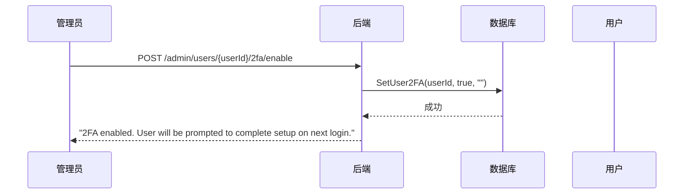
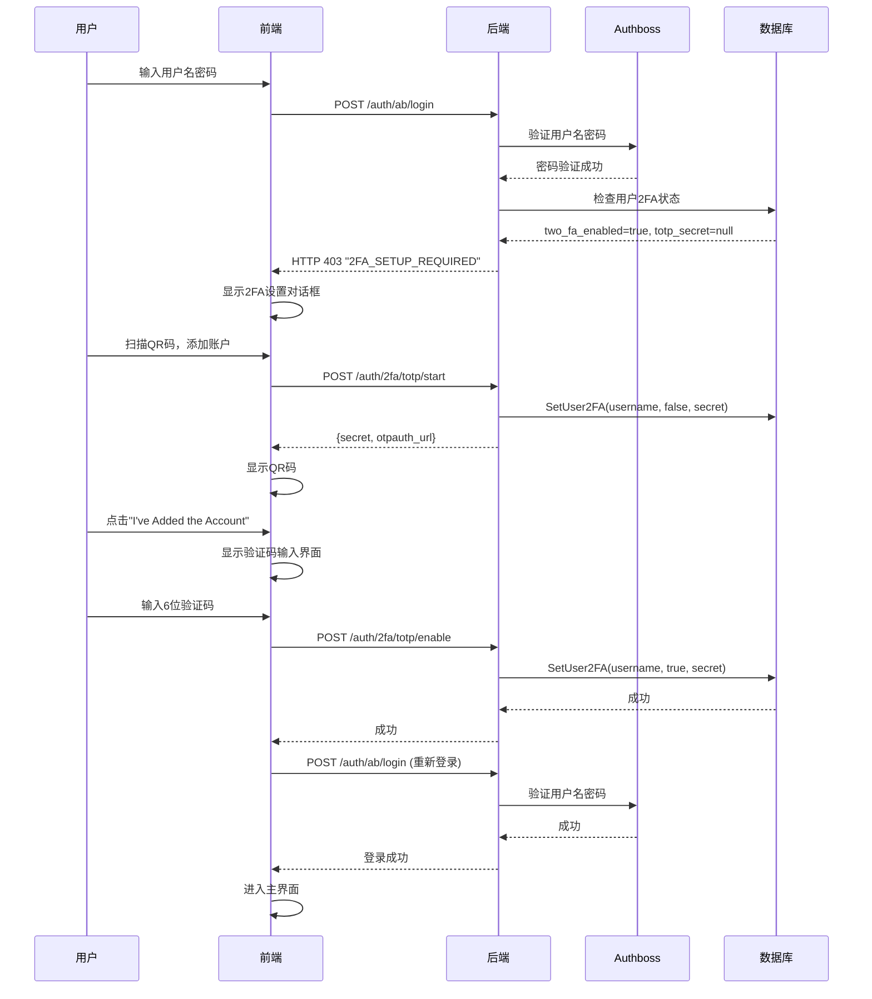
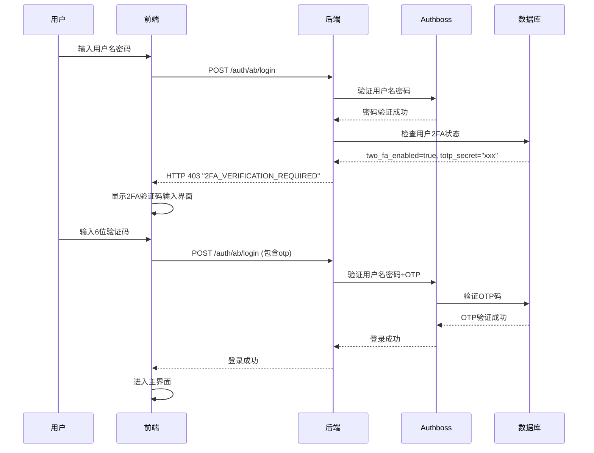

# 2FA 最佳实践处理逻辑

## 当前问题分析

### 1. 管理员启用2FA后的用户流程问题
- **问题**: 管理员启用用户2FA后，用户首次登录时直接弹出QR码设置对话框
- **问题**: 用户扫描QR码后关闭对话框，没有进入2FA验证阶段
- **问题**: 用户完成2FA设置后，后续登录流程不清晰

### 2. 2FA验证流程问题
- **问题**: 缺少2FA验证码输入界面
- **问题**: 验证失败后没有自动logout机制
- **问题**: 用户状态管理不完整

## 最佳实践处理逻辑

### 阶段1: 管理员启用2FA



**关键点**:
- 管理员启用2FA时，只设置 `two_fa_enabled = true`，不设置 `totp_secret`
- 用户状态: `two_fa_enabled = true, totp_secret = null`

### 阶段2: 用户首次登录（需要2FA设置）



**关键点**:
- 用户状态: `two_fa_enabled = true, totp_secret = null` → 需要2FA设置
- 2FA设置完成后，用户状态: `two_fa_enabled = true, totp_secret = "xxx"`
- 设置完成后需要重新登录

### 阶段3: 用户后续登录（需要2FA验证）



**关键点**:
- 用户状态: `two_fa_enabled = true, totp_secret = "xxx"` → 需要2FA验证
- 验证失败时自动logout
- 验证成功后进入主界面

## 实现方案

### 1. 后端修改

#### 修改登录处理逻辑 (`internal/handler/auth.go`)

```go
// 在Authboss登录成功后，检查2FA状态
func check2FAStatusAfterLogin(w http.ResponseWriter, r *http.Request, username string) {
    db := database.GetDatabase()
    if db == nil {
        return
    }
    
    user, err := db.GetUser(username)
    if err != nil {
        return
    }
    
    // 检查2FA状态
    if user.TwoFAEnabled {
        if user.TOTPSecret == "" {
            // 需要2FA设置
            write2FASetupRequiredResponse(w)
            return
        } else {
            // 需要2FA验证
            write2FAVerificationRequiredResponse(w)
            return
        }
    }
    
    // 2FA未启用，正常登录
    writeLoginSuccessResponse(w)
}
```

#### 添加2FA验证中间件 (`internal/middleware/2fa_verification.go`)

```go
func TwoFAVerificationMiddleware(next http.Handler) http.Handler {
    return http.HandlerFunc(func(w http.ResponseWriter, r *http.Request) {
        // 检查用户是否需要2FA验证
        if pid, ok := ab.GetSession(r, ab.SessionKey); ok && pid != "" {
            if db := database.GetDatabase(); db != nil {
                if appUser, err := db.GetUser(pid); err == nil && appUser != nil {
                    // 如果用户已启用2FA且有secret，但未完成验证
                    if appUser.TwoFAEnabled && appUser.TOTPSecret != "" {
                        // 检查是否已完成2FA验证
                        if !is2FAVerified(r) {
                            write2FAVerificationRequiredResponse(w)
                            return
                        }
                    }
                }
            }
        }
        
        next.ServeHTTP(w, r)
    })
}
```

### 2. 前端修改

#### 修改登录表单 (`frontend/components/auth/login-form.tsx`)

```typescript
export function LoginForm({ onLogin }: LoginFormProps) {
  const [formData, setFormData] = useState<LoginRequest>({
    username: "",
    password: ""
  })
  const [isLoading, setIsLoading] = useState(false)
  const [error, setError] = useState("")
  const [show2FASetup, setShow2FASetup] = useState(false)
  const [show2FAVerification, setShow2FAVerification] = useState(false)
  const [loginStep, setLoginStep] = useState<'login' | '2fa-setup' | '2fa-verify'>('login')
  const [otpCode, setOtpCode] = useState("")

  const handleSubmit = async (e: React.FormEvent) => {
    e.preventDefault()
    setIsLoading(true)
    setError("")

    try {
      const result = await apiClient.login(formData)

      if (result.status === 'success') {
        onLogin()
      }
    } catch (error: any) {
      const errorMessage = error?.message || 'Login failed'

      // 处理2FA相关错误
      if (errorMessage.includes('2FA_SETUP_REQUIRED')) {
        setLoginStep('2fa-setup')
        setShow2FASetup(true)
        setError("Please complete 2FA setup")
      } else if (errorMessage.includes('2FA_VERIFICATION_REQUIRED')) {
        setLoginStep('2fa-verify')
        setShow2FAVerification(true)
        setError("Please enter your 2FA verification code")
      } else {
        setError(errorMessage)
      }
    } finally {
      setIsLoading(false)
    }
  }

  const handle2FASetupComplete = async () => {
    setShow2FASetup(false)
    setError("")
    // 2FA设置完成后，尝试重新登录
    try {
      await apiClient.login(formData)
      onLogin()
    } catch (error) {
      setError(error instanceof Error ? error.message : "Login failed after 2FA setup")
    }
  }

  const handle2FAVerification = async () => {
    if (!otpCode.trim()) {
      setError("Please enter your 2FA verification code")
      return
    }

    setIsLoading(true)
    try {
      const result = await apiClient.login({ ...formData, otp: otpCode })
      if (result.status === 'success') {
        onLogin()
      }
    } catch (error: any) {
      setError(error?.message || '2FA verification failed')
      // 验证失败，自动logout
      await apiClient.logoutUser()
    } finally {
      setIsLoading(false)
    }
  }

  return (
    <Card className="w-full max-w-md mx-auto">
      <CardHeader className="space-y-1">
        <CardTitle className="text-2xl font-bold">System Login</CardTitle>
        <CardDescription>
          Enter your credentials to access the system
        </CardDescription>
      </CardHeader>
      
      {loginStep === 'login' && (
        <form onSubmit={handleSubmit}>
          <CardContent className="space-y-4">
            <div className="space-y-2">
              <Label htmlFor="username">Username</Label>
              <Input
                id="username"
                type="text"
                value={formData.username}
                onChange={(e) => setFormData(prev => ({ ...prev, username: e.target.value }))}
                placeholder="admin"
                required
              />
            </div>

            <div className="space-y-2">
              <Label htmlFor="password">Password</Label>
              <Input
                id="password"
                type="password"
                value={formData.password}
                onChange={(e) => setFormData(prev => ({ ...prev, password: e.target.value }))}
                placeholder="Enter password"
                required
              />
            </div>

            {error && (
              <div className="text-sm text-red-500 bg-red-50 p-3 rounded-md border border-red-200">
                {error}
              </div>
            )}
          </CardContent>
          <CardFooter>
            <Button type="submit" className="w-full" disabled={isLoading}>
              {isLoading ? (
                <>
                  <Loader2 className="mr-2 h-4 w-4 animate-spin" />
                  Logging in...
                </>
              ) : (
                <>
                  <LogIn className="mr-2 h-4 w-4" />
                  Login
                </>
              )}
            </Button>
          </CardFooter>
        </form>
      )}

      {loginStep === '2fa-verify' && (
        <CardContent className="space-y-4">
          <div className="text-center">
            <h3 className="text-lg font-semibold">2FA Verification</h3>
            <p className="text-sm text-muted-foreground">
              Enter the 6-digit code from your authenticator app
            </p>
          </div>
          
          <div className="space-y-2">
            <Label htmlFor="otp">Verification Code</Label>
            <Input
              id="otp"
              type="text"
              value={otpCode}
              onChange={(e) => setOtpCode(e.target.value.replace(/\D/g, '').slice(0, 6))}
              placeholder="123456"
              className="text-center text-lg font-mono tracking-widest"
              maxLength={6}
            />
          </div>

          {error && (
            <div className="text-sm text-red-500 bg-red-50 p-3 rounded-md border border-red-200">
              {error}
            </div>
          )}
        </CardContent>
        <CardFooter className="flex gap-2">
          <Button variant="outline" onClick={() => setLoginStep('login')} className="flex-1">
            Back
          </Button>
          <Button onClick={handle2FAVerification} disabled={isLoading || otpCode.length !== 6} className="flex-1">
            {isLoading ? (
              <>
                <Loader2 className="mr-2 h-4 w-4 animate-spin" />
                Verifying...
              </>
            ) : (
              'Verify'
            )}
          </Button>
        </CardFooter>
      )}
      
      {/* 2FA设置对话框 */}
      {show2FASetup && (
        <TwoFASetupDialog
          open={show2FASetup}
          onOpenChange={setShow2FASetup}
          onSetupComplete={handle2FASetupComplete}
          isRequired={true}
        />
      )}
    </Card>
  )
}
```

#### 修改API客户端 (`frontend/lib/api.ts`)

```typescript
export interface LoginRequest {
  username: string
  password: string
  otp?: string  // 添加OTP字段
}

async login(data: LoginRequest): Promise<LoginResponse> {
  const response = await fetch(`${this.baseUrl}/auth/ab/login`, {
    method: 'POST',
    headers: {
      'Content-Type': 'application/json',
      'Accept': 'application/json',
    },
    body: JSON.stringify(data),
    credentials: 'include',
  })

  if (!response.ok) {
    const errorData = await response.json().catch(() => ({}))
    const errorMessage = errorData.error || errorData.message || 'Login failed'

    // 处理2FA相关错误
    if (errorMessage.includes('2FA_SETUP_REQUIRED')) {
      throw new Error(`2FA_SETUP_REQUIRED: ${errorMessage}`)
    } else if (errorMessage.includes('2FA_VERIFICATION_REQUIRED')) {
      throw new Error(`2FA_VERIFICATION_REQUIRED: ${errorMessage}`)
    }

    throw new Error(errorMessage)
  }

  const result = await response.json()
  if (result.status === 'success') {
    const meResponse = await this.request<{ user: UserInfo }>('/auth/me')
    if (meResponse.success && meResponse.data) {
      this.setUser((meResponse.data as any).user)
    }
    return { status: 'success', location: result.location }
  }

  throw new Error('Login failed')
}
```

### 3. 数据库状态管理

#### 用户2FA状态定义

```go
type AppUser struct {
    Username     string `json:"username"`
    Email        string `json:"email"`
    PasswordHash string `json:"password_hash"`
    Role         string `json:"role"`
    TwoFAEnabled bool   `json:"two_fa_enabled"`  // 管理员是否启用了2FA
    TOTPSecret   string `json:"totp_secret"`     // TOTP密钥
    CreatedAt    string `json:"created_at"`
    UpdatedAt    string `json:"updated_at"`
    LastLoginAt  string `json:"last_login_at"`
}
```

#### 状态转换逻辑

1. **初始状态**: `two_fa_enabled = false, totp_secret = ""`
2. **管理员启用2FA**: `two_fa_enabled = true, totp_secret = ""`
3. **用户完成2FA设置**: `two_fa_enabled = true, totp_secret = "xxx"`
4. **管理员禁用2FA**: `two_fa_enabled = false, totp_secret = ""`

## 安全考虑

### 1. 会话管理
- 2FA验证失败时立即清除会话
- 设置合理的会话超时时间
- 使用HttpOnly cookies防止XSS攻击

### 2. 错误处理
- 不泄露敏感信息（如TOTP密钥）
- 统一的错误响应格式
- 适当的日志记录

### 3. 用户体验
- 清晰的步骤指示
- 友好的错误提示
- 支持取消操作

## 测试场景

### 1. 管理员启用2FA
- [ ] 管理员可以成功启用用户2FA
- [ ] 用户状态正确更新
- [ ] 返回适当的提示信息

### 2. 用户首次登录（2FA设置）
- [ ] 用户登录时弹出2FA设置对话框
- [ ] QR码正确生成和显示
- [ ] 用户可以扫描QR码并添加账户
- [ ] 验证码输入正确验证
- [ ] 设置完成后自动重新登录

### 3. 用户后续登录（2FA验证）
- [ ] 用户登录时要求输入2FA验证码
- [ ] 验证码正确验证
- [ ] 验证失败时自动logout
- [ ] 验证成功后正常进入主界面

### 4. 错误处理
- [ ] 网络错误处理
- [ ] 无效验证码处理
- [ ] 会话超时处理
- [ ] 用户取消操作处理

## 部署注意事项

1. **配置检查**: 确保TOTP相关配置正确
2. **数据库迁移**: 如有必要，更新数据库schema
3. **中间件顺序**: 确保2FA中间件在正确位置
4. **测试验证**: 在生产环境部署前充分测试
5. **监控日志**: 设置适当的监控和日志记录

## 总结

这个最佳实践方案解决了当前2FA实现中的主要问题：

1. **清晰的流程**: 区分2FA设置和2FA验证两个阶段
2. **完整的状态管理**: 明确的用户状态转换逻辑
3. **良好的用户体验**: 友好的界面和错误处理
4. **安全性**: 适当的会话管理和错误处理
5. **可维护性**: 清晰的代码结构和文档

通过实施这个方案，可以确保2FA功能的安全性和易用性。