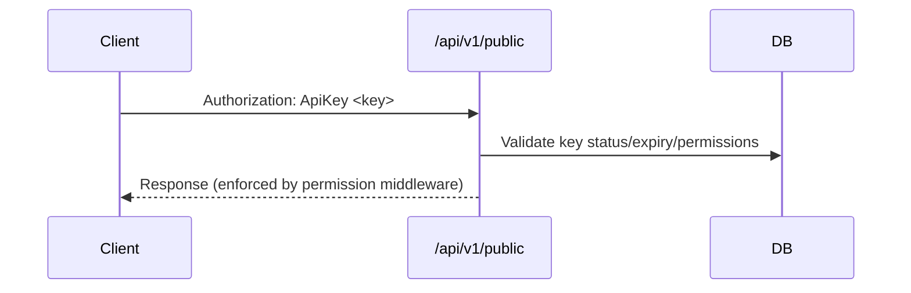

# Secure File Hub — Architecture & Flows

This document outlines the overall architecture, key modules, request flows, and user roles of the system.

## Components

- Backend: Go, Gorilla/Mux router under `/api/v1/*`
  - `internal/server`: Server wiring and middleware order
  - `internal/middleware`: HTTP middlewares (HTTPS redirect, CORS, logging, auth)
  - `internal/auth`: Authboss integration for session login, user adapter, cookie state
  - `internal/handler`: Web endpoints (`/api/v1/web/*`), public API (`/api/v1/public/*`), admin
  - `internal/database`: SQLite (modernc) persistence for files, users, roles, API keys, logs
  - `internal/apikey`, `internal/logger`, `internal/authz`: API key management, logging, authorization helpers

- Frontend: Next.js app consuming `/api/v1/web/*` with cookie-based session (Authboss)

- Storage: Local filesystem `downloads/` for file artifacts

## User Roles & Status

- Roles: `administrator`, `viewer` (default). Admins manage users, API keys, packages; viewers upload/download where allowed.
- Status: `active`, `pending`, `suspended`. Pending users have restricted access; suspended users are blocked by auth middleware.

## Route Map (high level)

- Web (cookie session): `/api/v1/web/*`
  - Authboss mount: `/api/v1/web/auth/ab/*` (login/logout/TOTP)
  - Current user: `/api/v1/web/auth/me`
  - Change password: `/api/v1/web/auth/change-password`
  - Files: upload/list/versions/download/recycle-bin
  - Versions (roadmap/recommendation): list/manifest/tags
  - Admin: API keys, users, usage, audit

- Public API (API key): `/api/v1/public/*`
  - Files: list/download/upload
  - Packages: list/update remark
  - API info, status, list

## Middleware Order (server)

1. HTTPS redirect (can be disabled via `DISABLE_HTTPS_REDIRECT`)
2. CORS (preflight short-circuit)
3. Logging
4. Authboss client state loader (session cookie decoding)
5. Auth middleware (exposes public paths, attaches user to context)

## Login Sequence (Web)

```mermaid
sequenceDiagram
  autonumber
  participant FE as Frontend
  participant BE as Backend
  participant AB as Authboss

  FE->>BE: POST /api/v1/web/auth/ab/login {username,password[,otp]}
  BE->>AB: Validate credentials, session/cookies
  AB-->>BE: 200 JSON {status:"success", location:"/api/v1/web/auth/me"}
  BE-->>FE: Set-Cookie ab_session; JSON payload
  FE->>BE: GET /api/v1/web/auth/me (with session cookie)
  BE->>BE: AuthMiddleware checks session, loads user
  BE-->>FE: 200 { success: true, data: { user } }
```

## Change Password (Web)

```mermaid
sequenceDiagram
  participant FE
  participant BE
  FE->>BE: POST /api/v1/web/auth/change-password {old_password,new_password}
  BE->>BE: Verify authenticated; check old pw; update hash; clear must-reset
  BE-->>FE: 200 { success: true }
```

## File Upload Flow (Web)

```mermaid
flowchart TD
  A[Client selects file]-->B[POST /api/v1/web/upload]
  B-->C{Authenticated?}
  C-->|No| D[401 Unauthorized]
  C-->|Yes| E[Store file under downloads/]
  E-->F[Insert metadata into DB]
  F-->G[Log upload event]
  G-->H[200 {success, data:fileInfo}]
```

## Download Flow (Web)

```mermaid
flowchart TD
  A[GET /api/v1/web/files/{path}]-->B[Validate path]
  B-->C{Exists?}
  C-->|No| D[404]
  C-->|Yes| E[Set headers]
  E-->F[Stream file]
```

## Public API (API Key) — Request Path



## Data Model Highlights

- `users`: username, password_hash (bcrypt), role, 2FA fields, must_reset, timestamps
- `user_roles`: user_id, role, permissions (JSON), quotas, status
- `files`: file metadata with versioning and status
- `api_keys`: hashed keys + role/permissions with status/expiry
- `api_usage_logs` / `file_audit_logs` / `access_logs`: observability and auditability

