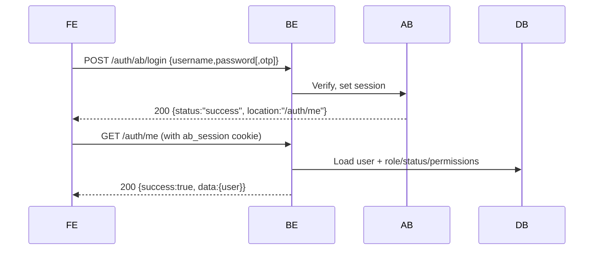
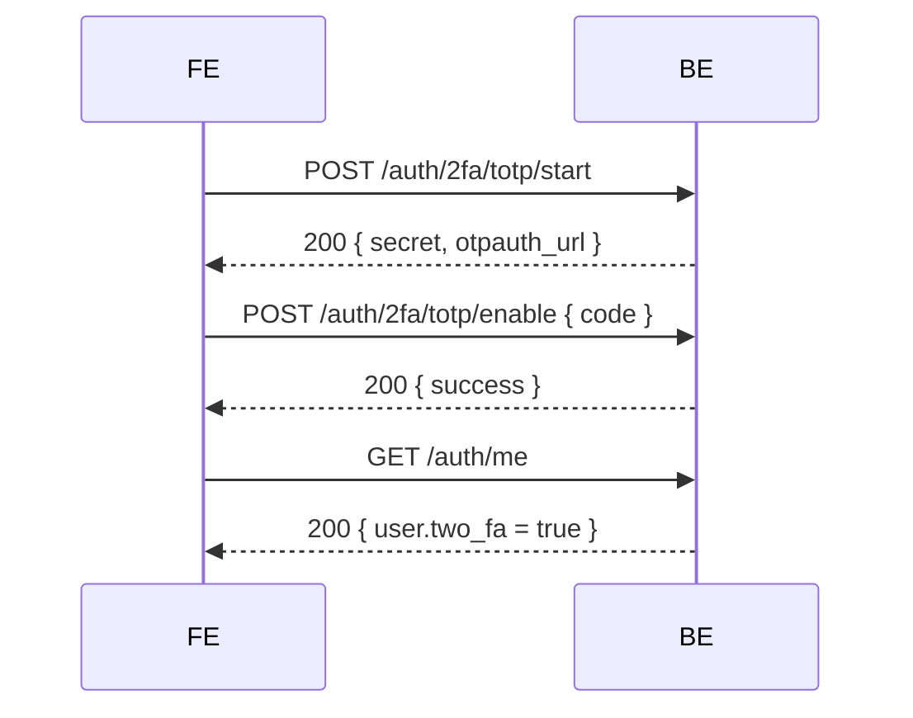

# Authentication & Authorization

This document describes how authentication (Authboss), session cookies, and authorization are implemented.

## Authboss Integration

- Mount path: `/api/v1/web/auth/ab`
- Login: `POST /api/v1/web/auth/ab/login` (JSON). On success returns 200 with JSON redirect payload and sets session cookie.
- Logout: `POST /api/v1/web/auth/ab/logout`
- TOTP 2FA: mounted by Authboss at `/api/v1/web/auth/ab/2fa/totp/*` and complemented with web wrappers.
- Successful login redirect target: `/api/v1/web/auth/me`

Cookies
- Cookies are written using `gorilla/securecookie` with keys loaded from `configs/config.json` or env:
  - `session.auth_key`, `session.enc_key` (or `SESSION_AUTH_KEY`, `SESSION_ENC_KEY`)
- Cookie flags: `HttpOnly`, `Secure`, `SameSite=Lax`. Use HTTPS to ensure cookies are accepted.

## Web Auth Flow

## Authorization

- `internal/middleware/auth.go`:
  - Exposes health/static/authboss/public endpoints without auth
  - Reads Authboss session, loads user from DB, attaches `*auth.User` to `r.Context()` (key: "user")
  - Enforces `suspended` users blocked; `must_reset` requires `/auth/change-password`

- `internal/middleware/authorize.go`:
  - Provides `RequireAuthorization` helper and permission checks (`RequirePermission`) for API/public routes

## Key Endpoints

- GET `/api/v1/web/auth/me` — returns current user (from context), role/status/permissions/quotas and 2FA flag
- POST `/api/v1/web/auth/change-password` — requires auth; verifies old password and sets new bcrypt hash
- GET `/api/v1/web/auth/users` — demo users listing (no auth)

## 2FA Lifecycle (Web wrappers)

