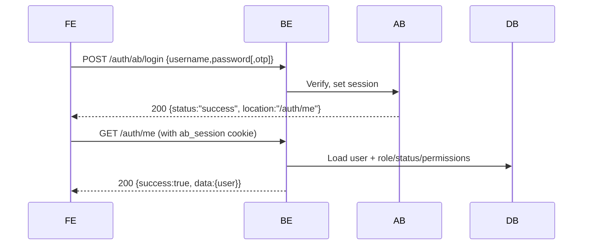
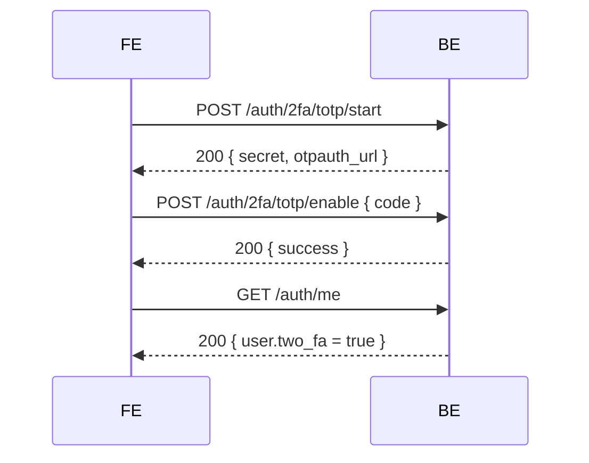

# Authentication & Authorization

## 统一认证架构

系统使用Authboss作为主要认证框架，提供session-based认证。

### 认证流程

1. **登录**: `POST /api/v1/web/auth/ab/login`
2. **会话验证**: 通过session cookie自动验证
3. **用户信息**: `GET /api/v1/web/auth/me`
4. **登出**: `POST /api/v1/web/auth/ab/logout`

### 2FA功能

- **设置**: `POST /api/v1/web/auth/2fa/totp/start`
- **启用**: `POST /api/v1/web/auth/2fa/totp/enable`
- **禁用**: `POST /api/v1/web/auth/2fa/disable`

注意：2FA功能将在后续版本中迁移到Authboss统一管理。

### 前端集成

```typescript
// 登录
await apiClient.login({ username, password })

// 检查认证状态
const user = apiClient.getCurrentUser()

// 登出
await apiClient.logoutUser()
```

### 安全特性

- Session-based认证，安全性更高
- HttpOnly cookies，防止XSS攻击
- Secure flag，强制HTTPS传输
- SameSite=Lax，防止CSRF攻击

## Authboss Integration

- Mount path: `/api/v1/web/auth/ab`
- Login: `POST /api/v1/web/auth/ab/login` (JSON). On success returns 200 with JSON redirect payload and sets session cookie.
- Logout: `POST /api/v1/web/auth/ab/logout`
- TOTP 2FA: mounted by Authboss at `/api/v1/web/auth/ab/2fa/totp/*` and complemented with web wrappers.
- Successful login redirect target: `/api/v1/web/auth/me`

## Cookies

Cookies are written using `gorilla/securecookie` with keys loaded from `configs/config.json` or env:
- `session.auth_key`, `session.enc_key` (or `SESSION_AUTH_KEY`, `SESSION_ENC_KEY`)
- Cookie flags: `HttpOnly`, `Secure`, `SameSite=Lax`. Use HTTPS to ensure cookies are accepted.

## Web Auth Flow



## Authorization

- `internal/middleware/auth.go`:
  - Exposes health/static/authboss/public endpoints without auth
  - Reads Authboss session, loads user from DB, attaches `*auth.User` to `r.Context()` (key: "user")
  - Enforces `suspended` users blocked

- `internal/middleware/authorize.go`:
  - Provides `RequireAuthorization` helper and permission checks (`RequirePermission`) for API/public routes

## Key Endpoints

- GET `/api/v1/web/auth/me` — returns current user (from context), role/status/permissions/quotas and 2FA flag
- POST `/api/v1/web/auth/ab/password` — requires auth; password change handled by Authboss
- GET `/api/v1/web/auth/users` — demo users listing (no auth)

## 2FA Lifecycle (Web wrappers)



