# Secure File Hub 项目设计文档

## 1. 项目概述

### 1.1 项目简介
Secure File Hub 是一个基于 Go + Next.js 的企业级安全文件管理系统，提供完整的文件上传下载、用户管理、权限控制和API管理功能。

### 1.2 核心特性
- **安全认证**：JWT Token + TOTP 2FA 双因子认证
- **权限控制**：基于 Casbin 的 RBAC 权限管理
- **文件管理**：支持版本控制、回收站、批量操作
- **用户管理**：GitLab 风格的用户管理界面
- **API管理**：完整的 RESTful API 和密钥管理
- **监控分析**：详细的访问日志和使用分析

### 1.3 技术栈
- **后端**：Go 1.23 + Gorilla Mux + SQLite + Casbin
- **前端**：Next.js 14 + React 18 + TypeScript + Tailwind CSS  
- **认证**：JWT + TOTP (Google Authenticator 兼容)
- **部署**：Docker + Docker Compose

## 2. 系统架构

### 2.1 整体架构图

```mermaid
graph TB
    subgraph "客户端层"
        A[Web 前端<br/>Next.js] 
        B[移动端/API客户端]
        C[第三方应用]
    end
    
    subgraph "网络层"
        D[HTTPS/TLS 加密]
        E[反向代理<br/>Nginx (可选)]
    end
    
    subgraph "应用层"
        F[Go HTTP Server<br/>Gorilla Mux]
        G[中间件层<br/>认证/授权/日志]
        H[业务逻辑层<br/>Handler Services]
    end
    
    subgraph "数据层"
        I[SQLite 数据库<br/>用户/文件/日志]
        J[文件存储<br/>downloads 目录]
        K[配置存储<br/>configs 目录]
    end
    
    A --> D
    B --> D
    C --> D
    D --> E
    E --> F
    F --> G
    G --> H
    H --> I
    H --> J
    H --> K
```

### 2.2 模块架构图

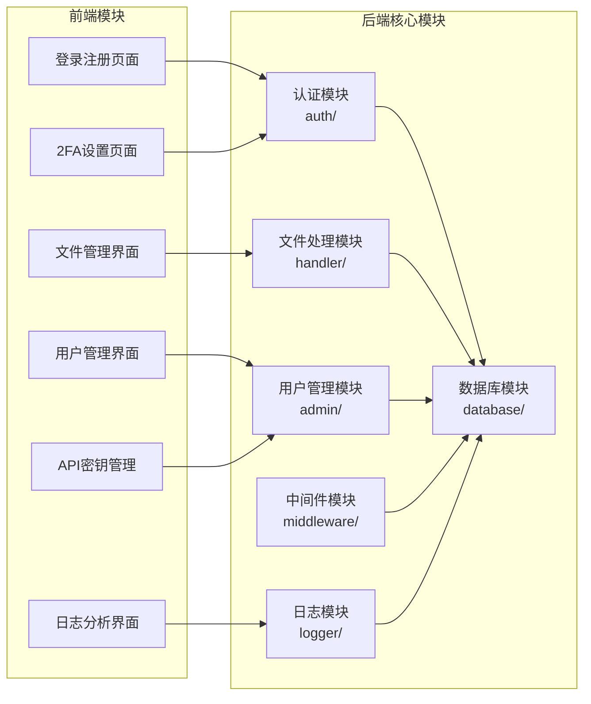

## 3. 数据库设计

### 3.1 数据库表结构

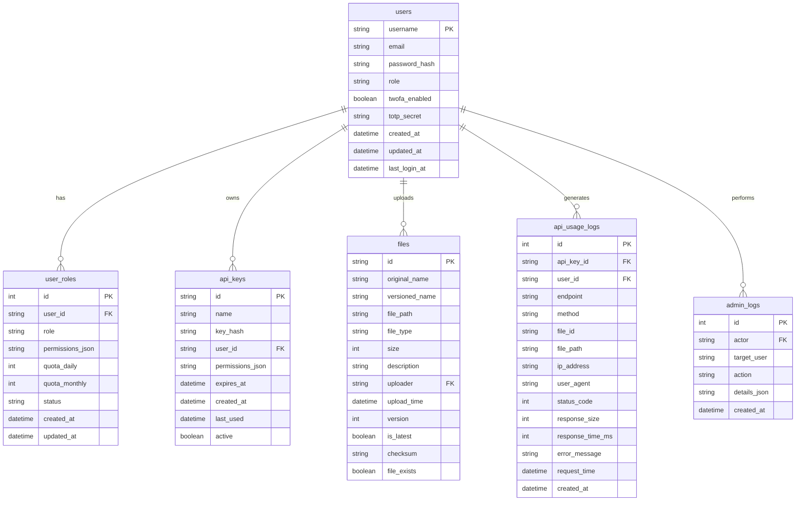

## 4. 用户认证流程

### 4.1 登录认证时序图

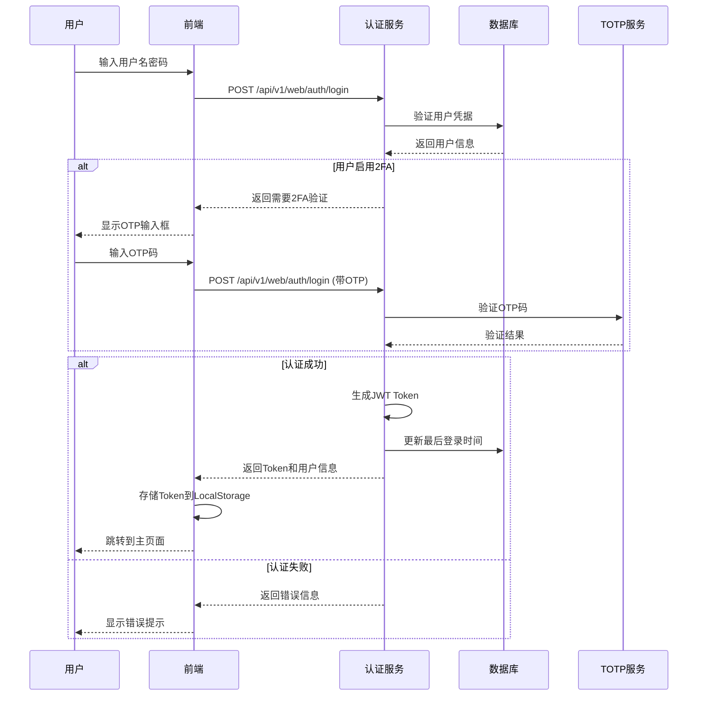

### 4.2 2FA设置流程图

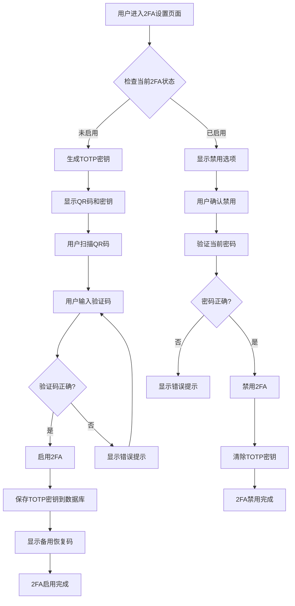

## 5. 文件管理流程

### 5.1 文件上传流程图

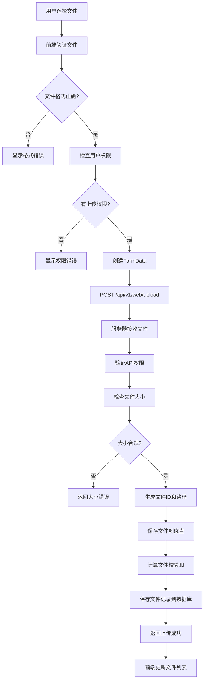

### 5.2 文件下载时序图

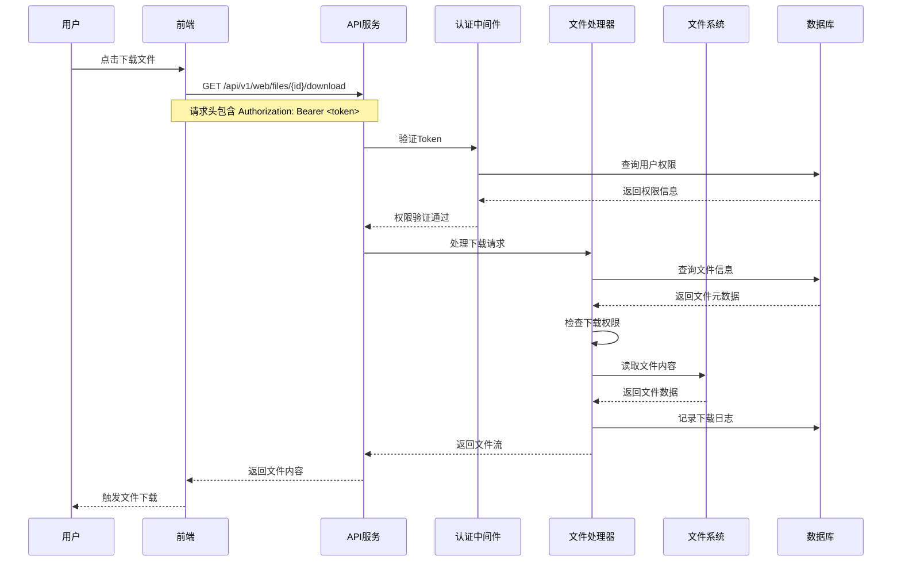

## 6. 用户管理流程

### 6.1 用户注册审批流程图

```mermaid
flowchart TD
    A[用户提交注册申请] --> B[POST /api/v1/web/auth/register]
    B --> C[验证注册信息]
    C --> D{信息有效?}
    
    D -->|否| E[返回验证错误]
    D -->|是| F[创建用户记录]
    F --> G[设置用户状态为 pending]
    G --> H[发送注册成功响应]
    
    H --> I[管理员登录管理界面]
    I --> J[查看待审批用户列表]
    J --> K[管理员点击 Approve]
    K --> L[POST /api/v1/web/admin/users/{username}/approve]
    
    L --> M[更新用户状态为 active]
    M --> N[记录管理员操作日志]
    N --> O[用户可正常登录]
    
    J --> P[管理员点击 Suspend]
    P --> Q[POST /api/v1/web/admin/users/{username}/suspend]
    Q --> R[更新用户状态为 suspended]
    R --> S[用户被禁止登录]
```

### 6.2 用户角色权限管理

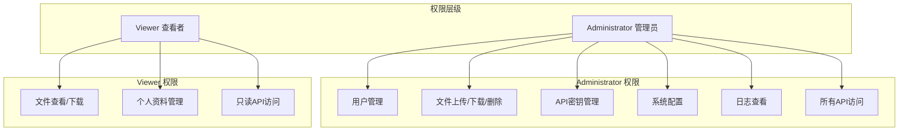

## 7. API管理流程

### 7.1 API密钥创建流程图

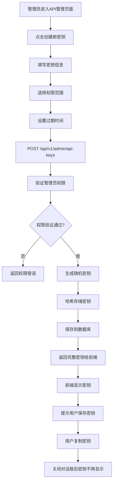

### 7.2 API调用监控流程

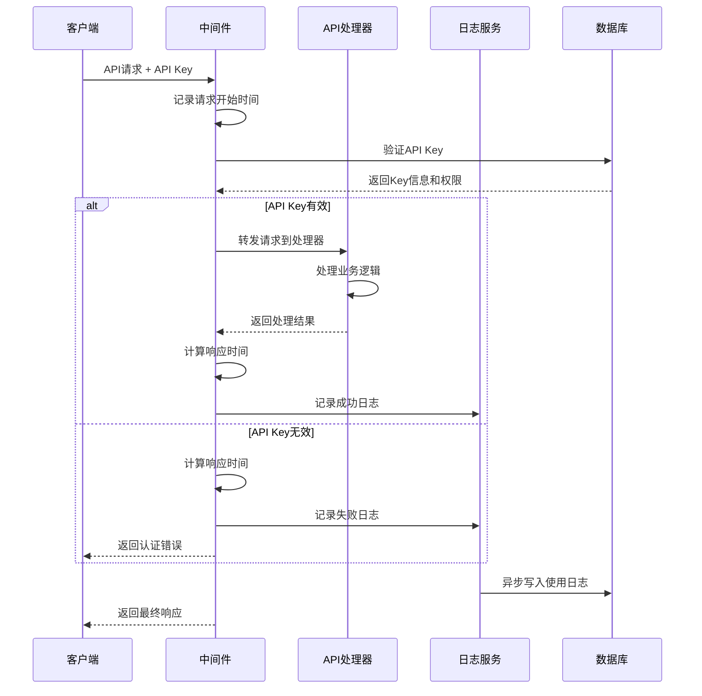

## 8. 系统监控与日志

### 8.1 日志记录架构

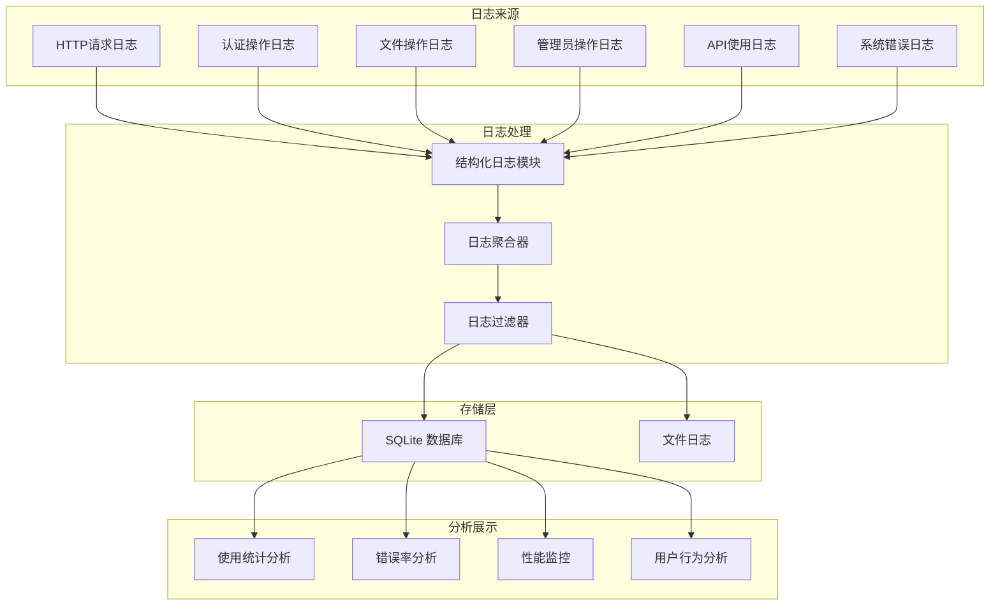

### 8.2 系统健康检查流程

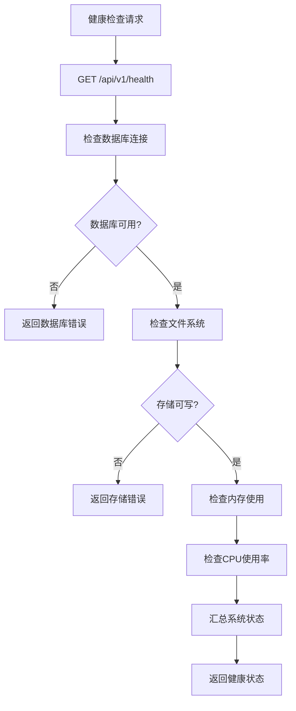

## 9. 部署架构

### 9.1 Docker部署架构

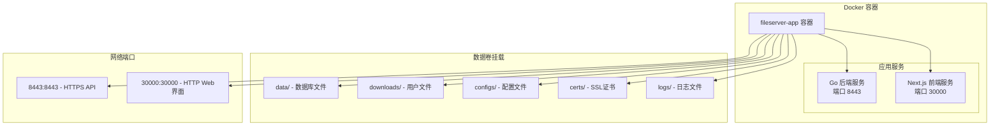

### 9.2 生产环境部署流程

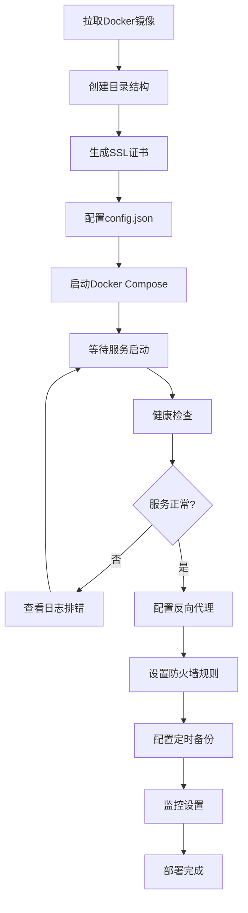

## 10. 安全设计

### 10.1 安全防护体系

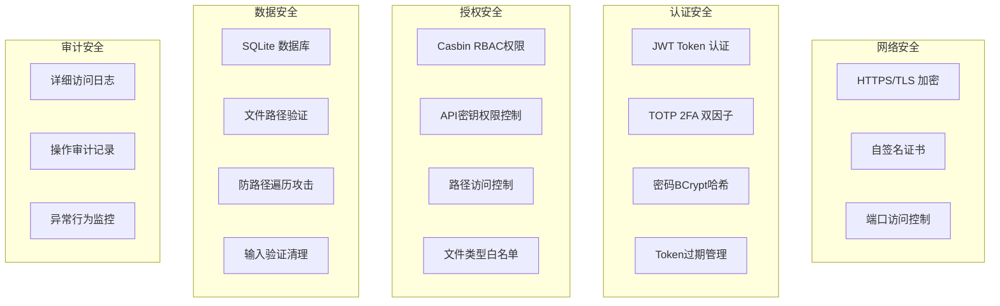

### 10.2 权限控制矩阵

| 功能模块 | Administrator | Viewer | 匿名用户 |
|---------|---------------|--------|----------|
| 用户注册 | ✅ | ✅ | ✅ |
| 用户登录 | ✅ | ✅ | ❌ |
| 文件上传 | ✅ | ❌ | ❌ |
| 文件下载 | ✅ | ✅ | ❌ |
| 文件删除 | ✅ | ❌ | ❌ |
| 用户管理 | ✅ | ❌ | ❌ |
| API密钥管理 | ✅ | ❌ | ❌ |
| 系统配置 | ✅ | ❌ | ❌ |
| 日志查看 | ✅ | ❌ | ❌ |
| 健康检查 | ✅ | ✅ | ✅ |

## 11. 接口设计

### 11.1 RESTful API 概览

| 模块 | 端点 | 方法 | 权限要求 | 描述 |
|------|------|------|----------|------|
| **认证模块** | | | | |
| | `/api/v1/web/auth/register` | POST | 公开 | 用户注册 |
| | `/api/v1/web/auth/login` | POST | 公开 | 用户登录 |
| | `/api/v1/web/auth/logout` | POST | 已认证 | 用户登出 |
| | `/api/v1/web/auth/2fa/setup` | POST | 已认证 | 设置2FA |
| | `/api/v1/web/auth/2fa/enable` | POST | 已认证 | 启用2FA |
| | `/api/v1/web/auth/2fa/disable` | POST | 已认证 | 禁用2FA |
| **文件模块** | | | | |
| | `/api/v1/web/files/list` | GET | 已认证 | 文件列表 |
| | `/api/v1/web/files/{id}/download` | GET | 已认证 | 文件下载 |
| | `/api/v1/web/upload` | POST | upload权限 | 文件上传 |
| | `/api/v1/web/files/{id}/delete` | POST | admin权限 | 删除文件 |
| **管理模块** | | | | |
| | `/api/v1/web/admin/users` | GET | admin权限 | 用户列表 |
| | `/api/v1/web/admin/users/{username}` | PATCH | admin权限 | 更新用户 |
| | `/api/v1/web/admin/users/{username}/approve` | POST | admin权限 | 批准用户 |
| | `/api/v1/web/admin/users/{username}/suspend` | POST | admin权限 | 冻结用户 |
| **API密钥** | | | | |
| | `/api/v1/admin/api-keys` | GET | admin权限 | 密钥列表 |
| | `/api/v1/admin/api-keys` | POST | admin权限 | 创建密钥 |
| | `/api/v1/admin/api-keys/{id}` | DELETE | admin权限 | 删除密钥 |

## 12. 性能优化

### 12.1 缓存策略

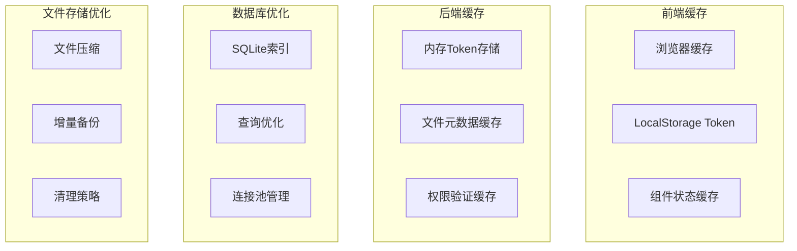

### 12.2 监控指标

- **性能指标**：响应时间、吞吐量、错误率
- **资源指标**：CPU使用率、内存使用、磁盘空间
- **业务指标**：用户活跃度、文件上传下载量、API调用频率
- **安全指标**：认证失败次数、异常访问模式、权限违规尝试

---

## 结论

本设计文档详细描述了 Secure File Hub 项目的整体架构、核心流程和技术实现。项目采用现代化的微服务架构，注重安全性和可扩展性，为企业级文件管理提供了完整的解决方案。

通过清晰的模块划分、完善的权限控制和详细的日志审计，系统能够满足企业对文件管理安全性、可靠性和可管理性的要求。